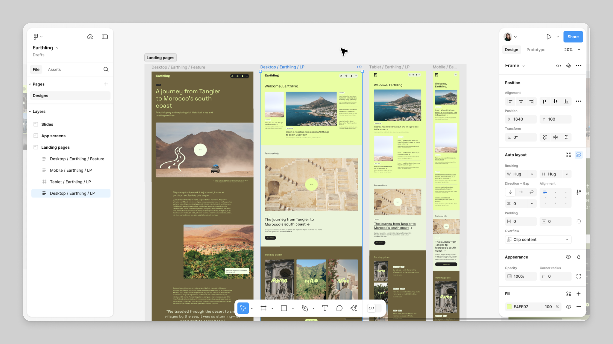
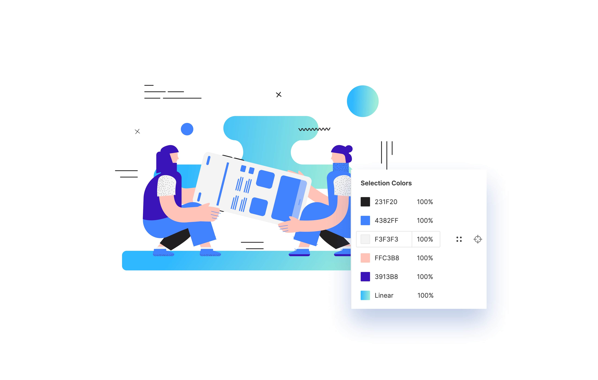

Kamu ingin menjadi seorang UI/UX Designer tahun ini? Eitts.. Tunggu dulu! Sebelum bekerja dalam bidang ini, kamu perlu mengetahui berbagai tools pendukung untuk kamu bekerja dan mencapai creative goals dalam setiap project.

Salah satu tools yang bisa kamu gunakan adalah aplikasi Figma. Melalui Figma, kamu bisa mendesain interface yang kreatif. Lantas apa itu Figma? Yuk, bahas tuntas soal Figma secara lengkap di bawah ini!

‎ 

## Apa Itu Figma?
Seperti yang telah dijelaskan sebelumnya bahwa aplikasi Figma merupakan tools canggih yang membantu untuk mendesain apapun khususnya produk digital seperti website dan mobile apps. Utamanya Figma digunakan untuk merancang user interface design (UI) karena memiliki fitur yang dapat variatif, namun keunggulan Figma lainnya juga dapat membantu kamu membuat user experience (UX) design. 

Saat ini, Figma merupakan bagian dari Adobe dan memiliki paket gratis yang mencakup kolaborator tak terbatas. Sehingga, kamu yang baru ingin terjun sebagai UI/UX Designer bisa memilih dari langganan berbayar jika memerlukan akses lebih banyak.

‎ 

## Fitur Utama pada Figma

Aplikasi Figma dibuat dengan memiliki beberapa fitur canggih yang membantumu untuk bekerja. Adapun beberapa nama fitur tersebut antara lain sebagai berikut.

### Prototype
Aplikasi Figma menyediakan fitur prototype dalam melakukan proses desain saat membangun website maupun aplikasi. Ada berbagai fitur prototype yang dapat kamu coba seperti GIF hingga ragam jenis interaksi yang dapat kamu coba.

### Desain
Figma menawarkan berbagai fitur desain yang menarik dan membuat desain yang kamu buat secara responsif dan otomatis menggunakan plugin. Atribut design yang bisa kamu coba seperti open type, pen tool modern, stretch to fill, dan lainnya.

### Collaboration
Selanjutnya, aplikasi Figma memiliki fitur collaboration yang dapat kamu gunakan ketika kamu bekerja dalam tim untuk membuat desain. Fitur ini akan memudahkan kamu bekerja sama dalam satu page yang akan otomatis tersimpan secara realtime.

### Design System
Melalui fitur ini kamu dapat menikmati library dan aset yang lengkap dalam aplikasi Figma. Fitur ini akan memperlihatkan aksesibilitas dan elemen pendukung lainnya yang cukup lengkap untuk kamu coba.

‎ 

## Kelebihan dan Kekurangan Figma

### Kelebihan Figma
Dengan adanya berbagai fitur menarik serta manfaatnya, aplikasi Figma juga memiliki kelebihan lainnya dibandingkan dengan aplikasi lain untuk design interface. Adapun beberapa kelebihan aplikasi Figma yaitu:

-- Dapat berkolaborasi secara realtime, ini akan memudahkan kamu dapat bekerja sama dengan berbagai kemudahan

-- Terdapat berbagai macam plugin yang dapat dicoba

-- Memiliki basis cloud storage yang membantu kamu memiliki akses dengan rekanmu secara online

### Kekurangan Figma
Meskipun aplikasi Figma memiliki kelebihan namun aplikasi ini juga memiliki kekurangan yang perlu kamu ketahui sebelum memutuskan untuk menggunakannya. Berikut beberapa kekurangan Figma di antaranya yaitu:

-- Tidak dapat diakses secara offline, sehingga membutuhkan akses internet yang cepat ketika mengoperasikannya

-- Memerlukan Intel HD 4000 maupun lebih tinggi dari itu

-- Adanya local caches yang dapat mempersulit pengguna untuk melihat berbagai perusahan desain.

Jadi, Figma merupakan sebuah aplikasi atau software yang dapat memudahkan kamu untuk melakukan desain interface. Terimakasih.

[Source: KELAS-WORK](https://kelas.work/blogs/mengenal-fitur-fitur-figma-hingga-manfaatnya-bagi-para-designer)