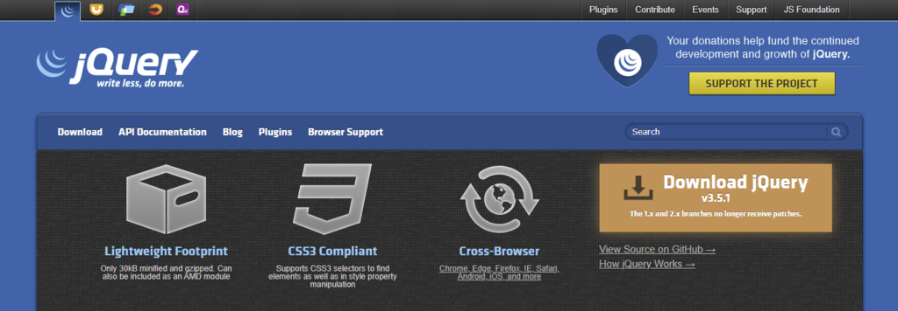
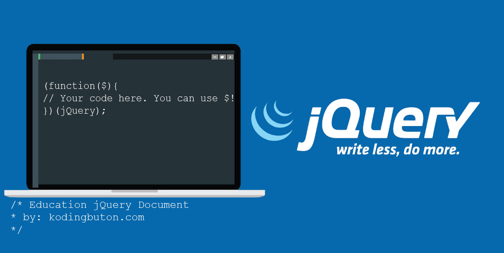

jQuery adalah library JavaScript open-source yang di-minify dan dibuat untuk operasi JavaScript yang disederhanakan. Anda bisa menggunakan jQuery untuk coding serangkaian perintah dengan cepat, yang pada dasarnya akan memerlukan waktu lebih lama apabila menggunakan kode HTML.

SBisa dibilang, library jQuery adalah JS library yang paling populer di pasaran saat ini. Library ini mudah dimodifikasi dan digunakan, serta memiliki komunitas yang besar dengan banyak sekali materi pembelajaran, tutorial, dan dokumentasi lainnya.

## Kelebihan dan Kekurangan

Kalau Anda masih menimbang-nimbang apakah ‘worth it’ untuk mempelajari jQuery, sebaiknya ketahui dulu kelebihan dan kekurangan penggunaan JS library ini untuk web development.

## Kelebihan

Salah satu kelebihan jQuery adalah event handling atau penanganan event. Pembuatan event seperti fungsi mouse click (klik mouse) dan form submission (pengiriman form) hanya memerlukan beberapa baris kode. Dengan begitu, kode HTML bisa tetap bersih dan bebas dari event handler. Selain itu, mudah untuk memodifikasi elemen HTML berkat fitur DOM (Document Object Model) manipulation yang dimilikinya.

Metode AJAX secara khusus membuat jQuery sangat sesuai untuk mengembangkan website responsif menggunakan fungsi AJAX. Fitur ini meningkatkan pengalaman pengguna dengan menyederhanakan operasi permintaan HTTP tanpa harus reload halaman web.
jQuery juga menyertakan dukungan lintas browser sehingga kompatibel dengan web browser yang populer saat ini. Library ini juga berfungsi dengan syntax CSS3 selector dan XML Path language.

## Kekurangan

Meskipun ringan, library jQuery sangatlah besar. Karena base kodenya terus berkembang, perlu waktu yang tidak sebentar untuk membuka file JS, yang juga akan memperberat kinerja komputer user.

jQuery juga sedikit mempersulit proses pembelajaran dan penggunaan JavaScript karena abstraksinya. Meskipun mampu menyederhanakan pembuatan event bagi pemula, tugas-tugas rumit seperti manipulasi DOM akan membutuhkan pemahaman JavaScript yang lebih mendalam demi mendapatkan hasil yang diinginkan.

## Kesimpulan

jQuery adalah salah satu library JavaScript yang paling populer di dunia. Library ini menawarkan berbagai manfaat, khususnya bagi para web developer. Oleh karena itu, kalau Anda berprofesi menjadi web developer, penting sekali untuk mempelajari cara menggunakan jQuery. 

Library jQuery memungkinkan Anda menulis lebih sedikit kode JavaScript, tapi tetap bisa memanfaatkan fungsionalitasnya secara penuh. Dengan begitu, Anda bisa bekerja secara lebih efisien, dan bisa fokus pada bagian proyek lainnya yang perlu ditangani.