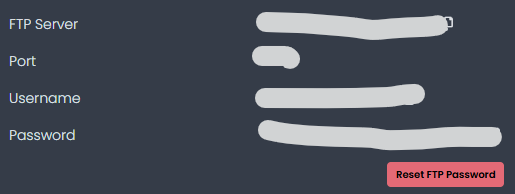
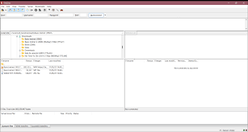
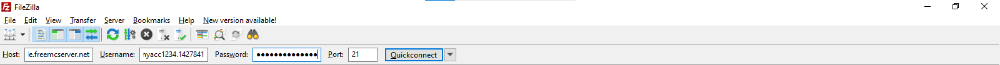

Ada beberapa cara yang bisa Anda gunakan untuk meng-upload file Anda ke server. Anda bisa menggunakan SFTP atau FTPS. FTPS adalah FTP yang menggunakan SSL. Dalam hal ini, Anda akan perlu untuk mengaktifkan dan installasi SSL Certficate pada server terlebih dahulu. Selain itu Anda juga bisa menggunakan SFTP (SSH File Transfer Protocol). SFTP merupakah extension dari SSH untuk memudahkan file transfer. Biasanya dalam melakukan data transfer dan control, port yang digunakan adalah port SSH. Pada artikel ini, Anda akan meng-upload file Anda ke server menggunakan filezilla.


## Yang Perlu Disiapkan
Untuk bisa meengakses server anda menggunakan Filezilla, Anda harus terlebih dahulu menginstall Filezilla pada komputer anda. Akses link https://filezilla-project.org/download.php untuk mengunduh Filezilla. Setelah anda mengunduh Filezilla, Anda juga harus mendapatkan informasi detail FTP dari server yang anda tuju. Misalnya: hostname, port, username, dan password.



## Cara menggunakan FTP

## 1. Buka Filezilla


## 2. Koneksi FTP dengan Filezilla

Pada bagian ini, terdapat detail FTP.
Host: Isi dengan nama server Anda, Misalnya:  freemcserver.net
Username: Isi dengan Username Server Anda
Password: Isi dengan Password Server Anda
Port: Isi dengan Port 21
Setelah itu Silahkan klik 
```
Quickconnect
```
Tunggu sebentar hingga muncul folder yang ada


## Kesimpulan
Untuk menggunakan ftp dengan Filezilla, Anda harus menginstall software Filezilla di komputer anda dan mengetahui informasi ftp detail di server yang anda inginkan. Untuk hostname, anda bisa memasukkan nama server. Kemudian masukkan username dan password server tujuan. Lalu isi port dengan 21. Setelah itu, Klik 
```
Quickconnect
```.
